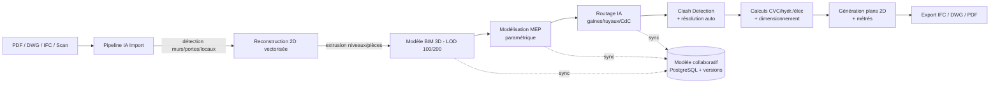

# 1. Architecture globale détaillée

## 1.1 Vue en couches

```
┌──────────────────────────────────────────────────────────────────────────┐
│  CLIENTS                                                                  │
│  Desktop (Windows, WPF/Helix Toolkit)   │   Web (SaaS, WebGPU/Three.js)   │
└──────────────────────────────────────────────────────────────────────────┘
                 │ gRPC / REST (Desktop online) │ HTTPS/WebSocket (Web)
┌──────────────────────────────────────────────────────────────────────────┐
│  API GATEWAY (ASP.NET Core, .NET 9) — Auth (OIDC), rate limiting, BFF     │
└──────────────────────────────────────────────────────────────────────────┘
        │                 │                    │                 │
┌───────────────┐ ┌───────────────┐  ┌─────────────────┐ ┌──────────────────┐
│ Project Service│ │ BIM Model     │  │ Collaboration    │ │ Catalog/Fabricants│
│ (métadonnées,  │ │ Service       │  │ Service (locks,  │ │ Service (familles │
│ permissions)   │ │ (CRUD modèle, │  │ versions, diff,  │ │ BIM, packs        │
│                │ │ historique)   │  │ merge worksets)  │ │ fabricants)       │
└───────────────┘ └───────────────┘  └─────────────────┘ └──────────────────┘
        │                 │                    │                 │
┌──────────────────────────────────────────────────────────────────────────┐
│  MOTEUR BIM PROPRIÉTAIRE (C++/C# natif — bibliothèque partagée)           │
│  ┌────────────┐ ┌───────────────┐ ┌─────────────┐ ┌─────────────────────┐│
│  │ Kernel     │ │ Paramétrique  │ │ Routage IA  │ │ Clash Detection      ││
│  │ géométrique│ │ (familles/    │ │ (A*/Dijkstra│ │ (BVH, résolution     ││
│  │ (OpenCascade│ │ types/occur.) │ │ /graphe 3D) │ │ auto)                ││
│  │ + BRep)    │ │               │ │             │ │                      ││
│  └────────────┘ └───────────────┘ └─────────────┘ └─────────────────────┘│
│  ┌────────────┐ ┌───────────────┐ ┌─────────────┐ ┌─────────────────────┐│
│  │ Calculs CVC│ │ Génération de │ │ Métrés/     │ │ IFC I/O              ││
│  │ /hydr./élec│ │ plans 2D      │ │ nomenclatures│ │ (IFC2x3/4/4.3)      ││
│  └────────────┘ └───────────────┘ └─────────────┘ └─────────────────────┘│
└──────────────────────────────────────────────────────────────────────────┘
        │                                              │
┌────────────────────────┐                 ┌───────────────────────────────┐
│  PIPELINE IA IMPORT     │                 │  RENDU 3D                     │
│  (Python, service async)│                 │  Desktop: Vulkan/DirectX 12   │
│  OCR + CV + Deep Learning│                │  Web: WebGPU / WebGL2 (Three) │
│  PDF/DWG/IFC → maquette │                 │  PBR, ombres RT, section box  │
└────────────────────────┘                 └───────────────────────────────┘
        │                                              │
┌──────────────────────────────────────────────────────────────────────────┐
│  PERSISTANCE                                                              │
│  PostgreSQL (métier + PostGIS pour géo/2D) │ Object storage S3-compatible │
│  (fichiers sources, exports, snapshots de maquette, modèles IA)          │
│  Redis (cache, sessions, verrous collaboratifs) │ Message broker (NATS/   │
│  RabbitMQ) pour jobs asynchrones (import IA, rendu batch, calculs lourds) │
└──────────────────────────────────────────────────────────────────────────┘
```

## 1.2 Principes directeurs

1. **Moteur BIM natif indépendant** : pas de dépendance à un host (AutoCAD/Revit). Le kernel géométrique
   (OpenCascade, BRep + maillage) et le modèle paramétrique sont propriétaires, exposés en bibliothèque
   partagée (`.dll`/`.so`) consommée par le Desktop **et** par les services backend (mêmes DLL, pas de
   réimplémentation métier côté serveur).
2. **Un seul modèle de données BIM**, source de vérité, versionné (event-sourcing léger : chaque modification
   d'élément produit un delta horodaté, rejouable — base du travail collaboratif et de l'historique LOD).
3. **Séparation stricte géométrie / paramétrique / métier** : le kernel géométrique ne connaît pas les notions
   de "CTA" ou "gaine" ; le modèle paramétrique (familles/types/occurrences) pilote la géométrie ; les modules
   métier (routage, calculs, clash) consomment le modèle paramétrique.
4. **IA en périphérie, jamais dans le chemin critique synchrone** : import PDF→maquette et copilote sont des
   jobs asynchrones qui proposent un résultat validé par l'ingénieur (aucune modification silencieuse du modèle).
5. **IFC comme format pivot d'interopérabilité**, pas comme modèle interne : le modèle interne est plus riche
   (paramétrique, historique, liens fabricants) ; IFC est une vue d'export/import.
6. **Desktop-first pour la performance de modélisation, Cloud-first pour la collaboration** (cf. §22/23) :
   le Desktop peut travailler hors-ligne sur un cache local (SQLite + fichiers), puis synchroniser.

## 1.3 Composants et technologies (résumé — détail en §11)

| Composant | Technologie | Justification |
|---|---|---|
| Kernel géométrique | C++ / OpenCascade (OCCT) | BRep robuste, standard industrie (FreeCAD, IFC++, etc.) |
| Interop kernel ↔ .NET | C++/CLI ou P/Invoke + wrapper `OCC.NET` | Isoler le C++ natif derrière une API C# stable |
| Moteur applicatif | C# / .NET 9 | Productivité, écosystème, portabilité (Linux/Windows) |
| Rendu Desktop | Helix Toolkit (DX11) court terme → Vulkan (via Silk.NET) moyen terme | Time-to-market puis performance |
| Rendu Web | WebGPU (fallback WebGL2, Three.js) | Aligné avec le prototype existant (Three.js) |
| Base de données | PostgreSQL 16 + PostGIS | Transactionnel + géométrie 2D pour plans/emprises |
| Stockage fichiers | S3-compatible (MinIO on-prem / S3 cloud) | Fichiers sources (PDF/DWG/IFC), gros blobs de maillage |
| IA / Computer Vision | Python, PyTorch (entraînement), ONNX Runtime (inférence embarquée) | Portabilité modèle → Desktop et serveur |
| IFC | IfcOpenShell (Python, pipeline import) + implémentation C# native pour l'I/O temps réel | Robustesse (IfcOpenShell) + perf (natif) |
| Interop CAO | Autodesk Forge/APS (Model Derivative, Data Management) | Pont vers écosystème Autodesk (option, pas dépendance) |
| Auth/Collab | OIDC (Keycloak/Auth0), gRPC, WebSocket (Yjs/CRDT pour édition concurrente légère) | Standards, CRDT pour merge sans conflit sur métadonnées |

## 1.4 Flux principal (import → maquette → export)



Voir [02-uml-diagrammes.md](02-uml-diagrammes.md) pour le détail des classes et séquences.
