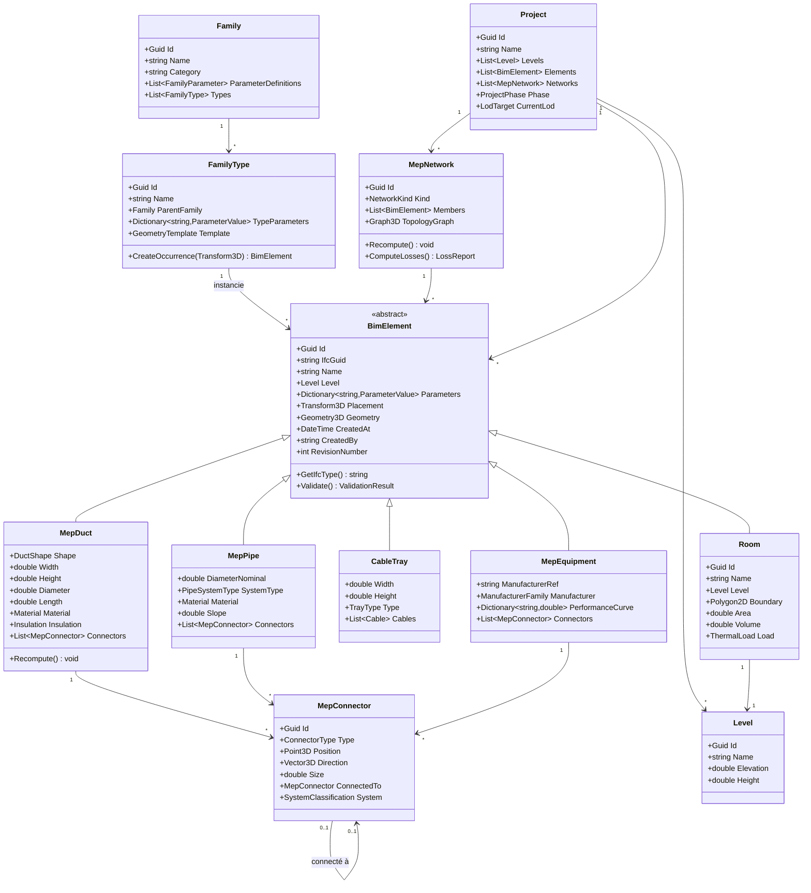
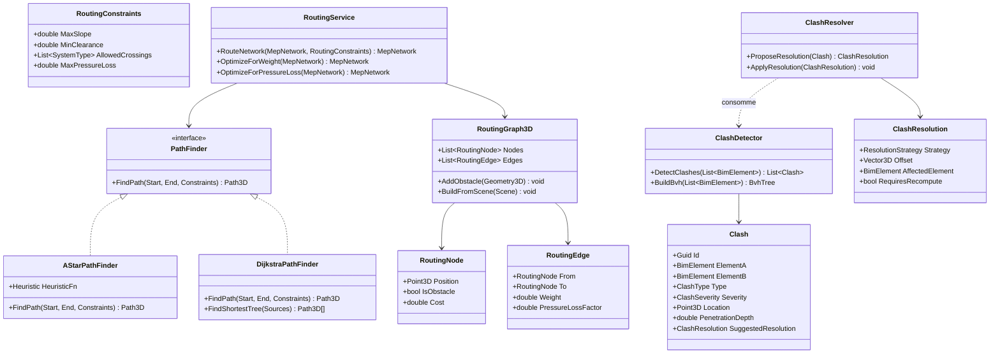
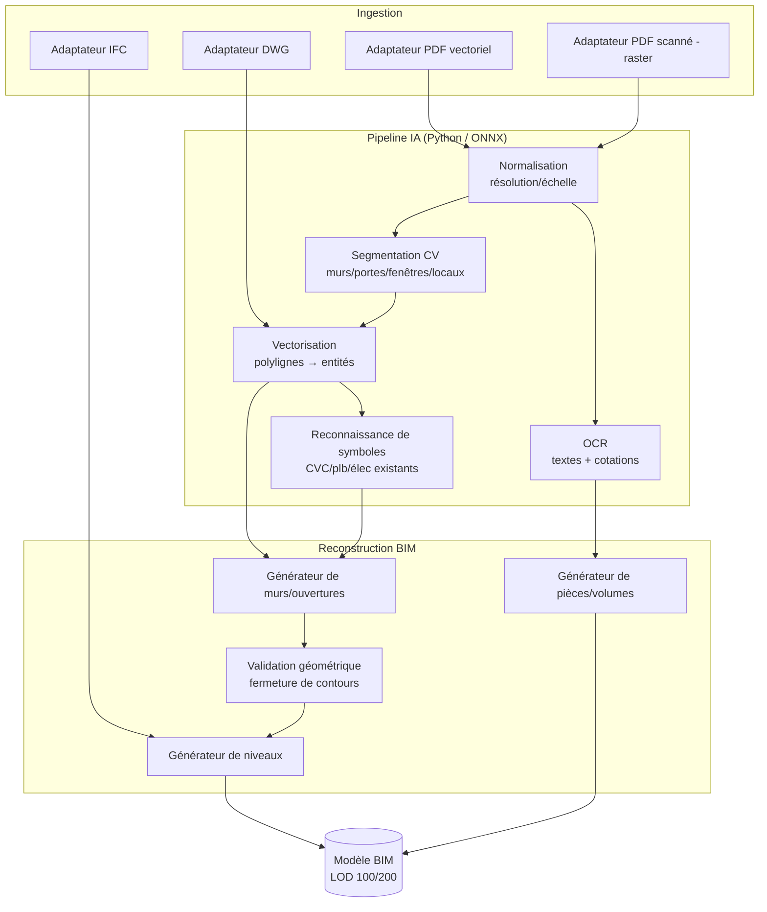
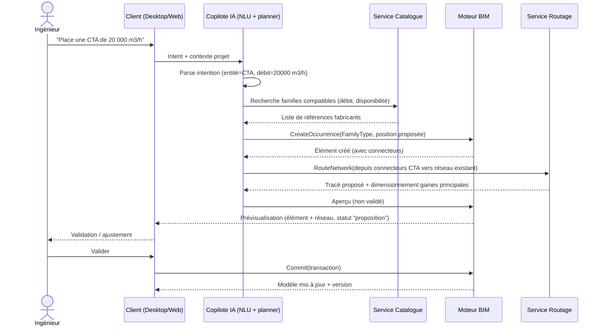
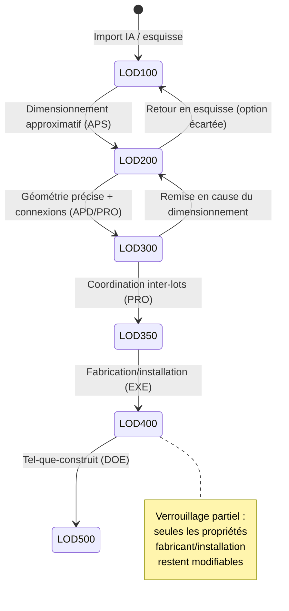

# 2. Diagrammes UML

## 2.1 Diagramme de classes — Modèle BIM central

## 2.2 Diagramme de classes — Routage & Clash Detection

## 2.3 Diagramme de composants — Pipeline import PDF/DWG/IFC → maquette

## 2.4 Diagramme de séquence — Commande copilote IA

## 2.5 Diagramme d'états — Cycle de vie d'un élément BIM (LOD)

