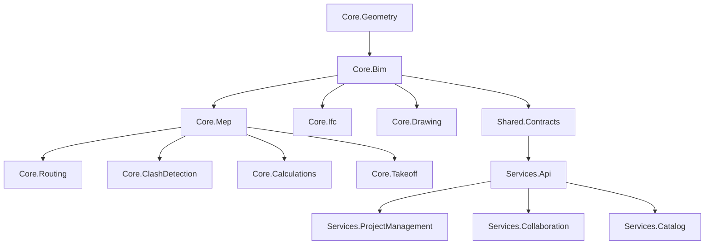

# 3 / 13. Structure complète du projet et du repository

## 3.1 Principe

Le repository reste **mono-repo** (cohérence des versions moteur ↔ pipeline IA ↔ web), organisé en workspaces
indépendants. Le prototype web actuel (`implantation_cvc_plb.html`, `js/`, `render2d/`, `render3d/`, `catalog/`)
est conservé tel quel sous `apps/legacy-web/` : c'est le banc d'essai UX/calculs qui continue de vivre pendant
que la plateforme cible monte en puissance, et sert de référence fonctionnelle (calibration, bilans, DXF).

## 3.2 Arborescence cible

```
IMPLANTATION-CVC/
├── ARCHITECTURE.md                     # historique du prototype web (existant)
├── docs/
│   └── bim-mep-platform/                # ce dossier — architecture, specs, roadmap
├── apps/
│   ├── legacy-web/                      # prototype existant (déplacement progressif, non-bloquant)
│   │   ├── implantation_cvc_plb.html
│   │   ├── js/  render2d/  render3d/  catalog/  tests/
│   ├── desktop/                         # client Windows (WPF + Helix Toolkit / Vulkan)
│   │   ├── BimMep.Desktop/
│   │   ├── BimMep.Desktop.Rendering/
│   │   └── BimMep.Desktop.Tests/
│   └── web-saas/                        # client web SaaS (Next.js/React + WebGPU/Three.js)
│       ├── src/
│       └── tests/
├── src/
│   └── BimMepPlatform/                  # moteur BIM natif + services .NET (voir §11)
│       ├── BimMepPlatform.sln
│       ├── Core.Geometry/               # wrapper OpenCascade (BRep, maillage, booléens)
│       ├── Core.Bim/                    # modèle BIM : entités, familles/types, paramétrique
│       ├── Core.Mep/                    # entités métier CVC/plomberie/électricité
│       ├── Core.Routing/                # moteur de routage (A*/Dijkstra, graphe 3D)
│       ├── Core.ClashDetection/         # détection et résolution de collisions (BVH)
│       ├── Core.Calculations/           # calculs aérauliques/hydrauliques/thermiques + normes
│       ├── Core.Ifc/                    # I/O IFC2x3/4/4.3
│       ├── Core.Drawing/                # génération plans/coupes/synoptiques 2D
│       ├── Core.Takeoff/                # métrés et nomenclatures
│       ├── Services.Api/                # API Gateway ASP.NET Core (REST/gRPC)
│       ├── Services.ProjectManagement/  # microservice projets/permissions
│       ├── Services.Collaboration/      # verrous, versions, merge worksets
│       ├── Services.Catalog/            # catalogue fabricants, familles BIM
│       └── Shared.Contracts/            # DTOs, contrats gRPC/proto, événements
├── ai/
│   ├── import-pipeline/                 # Python — OCR, CV, vectorisation PDF/scan/DWG
│   │   ├── ingestion/                   # adaptateurs PDF vectoriel, raster, DWG, IFC
│   │   ├── ocr/                         # reconnaissance texte/cotations
│   │   ├── vision/                      # segmentation murs/portes/fenêtres/locaux (Deep Learning)
│   │   ├── symbol_recognition/          # reconnaissance symboles CVC/plb/élec
│   │   ├── reconstruction/              # génération niveaux/pièces/volumes
│   │   └── training/                    # notebooks, jeux de données, export ONNX
│   ├── copilot/                         # copilote BIM (NLU, planification d'actions)
│   │   ├── nlu/
│   │   ├── planner/
│   │   └── skills/                      # "placer équipement", "optimiser réseau", ...
│   └── models/                          # modèles versionnés (ONNX), non commités (LFS/registry)
├── db/
│   ├── migrations/                      # migrations SQL (Flyway/EF Core Migrations)
│   └── seed/                            # données de référence (catalogue, normes)
├── fabricants/
│   └── packs/                           # packs fabricants (Daikin, Aldes, Systemair, TROX, Lindab, ...)
├── infra/
│   ├── docker/                          # Dockerfiles par service
│   ├── k8s/ ou terraform/               # déploiement cloud (voir §22/23)
│   └── ci/                              # pipelines CI/CD
├── tests/
│   ├── integration/
│   └── e2e/
└── tools/
    └── ifc-validator/, dxf-export-check/, ...
```

## 3.3 Règles de dépendance entre modules



Règle : les modules `Core.*` ne référencent **jamais** `Services.*` (le moteur reste utilisable en local, offline,
sans serveur). Seuls les `Services.*` référencent les `Core.*`.

## 3.4 Convention de nommage

- Espaces de noms C# : `BimMep.<Module>` (ex. `BimMep.Core.Routing`).
- IFC GUID : généré une seule fois à la création (`IfcGloballyUniqueId`, base64 22 caractères), jamais régénéré.
- Branches Git : `feature/<module>-<courte-description>`, `fix/...`, releases taguées `vMAJOR.MINOR.PATCH`.
