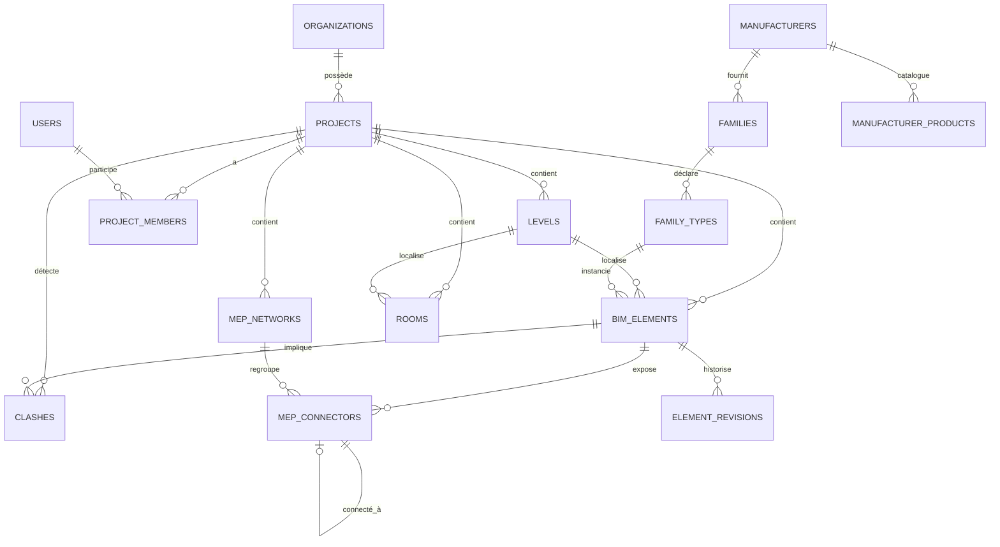

# 4. Base de données

## 4.1 Choix technologique

PostgreSQL 16 + extensions **PostGIS** (géométrie 2D des plans/emprises, index spatiaux GIST pour les requêtes de
zone) et **pgcrypto** (UUID). La géométrie 3D fine (BRep, maillages) n'est **pas** stockée en base relationnelle :
elle vit en object storage (S3/MinIO), la base ne référence que des métadonnées + une bounding box/centroïde
(colonne PostGIS) pour les requêtes spatiales grossières (clash à large échelle, culling).

## 4.2 Schéma relationnel (extrait — cœur du modèle)

```sql
-- Organisations, projets, permissions
CREATE TABLE organizations (
    id            UUID PRIMARY KEY DEFAULT gen_random_uuid(),
    name          TEXT NOT NULL,
    created_at    TIMESTAMPTZ NOT NULL DEFAULT now()
);

CREATE TABLE projects (
    id              UUID PRIMARY KEY DEFAULT gen_random_uuid(),
    organization_id UUID NOT NULL REFERENCES organizations(id),
    name            TEXT NOT NULL,
    phase           TEXT NOT NULL CHECK (phase IN ('APS','APD','PRO','EXE','DOE')),
    lod_target      SMALLINT NOT NULL DEFAULT 100 CHECK (lod_target IN (100,200,300,350,400,500)),
    created_at      TIMESTAMPTZ NOT NULL DEFAULT now(),
    updated_at      TIMESTAMPTZ NOT NULL DEFAULT now()
);

CREATE TABLE users (
    id            UUID PRIMARY KEY DEFAULT gen_random_uuid(),
    email         TEXT UNIQUE NOT NULL,
    display_name  TEXT NOT NULL
);

CREATE TABLE project_members (
    project_id  UUID NOT NULL REFERENCES projects(id) ON DELETE CASCADE,
    user_id     UUID NOT NULL REFERENCES users(id),
    role        TEXT NOT NULL CHECK (role IN ('owner','engineer','viewer','admin')),
    PRIMARY KEY (project_id, user_id)
);

-- Niveaux
CREATE TABLE levels (
    id          UUID PRIMARY KEY DEFAULT gen_random_uuid(),
    project_id  UUID NOT NULL REFERENCES projects(id) ON DELETE CASCADE,
    name        TEXT NOT NULL,
    elevation_m DOUBLE PRECISION NOT NULL,
    height_m    DOUBLE PRECISION NOT NULL,
    sort_order  INTEGER NOT NULL
);

-- Familles / types (bibliothèque, potentiellement partagée entre projets)
CREATE TABLE families (
    id          UUID PRIMARY KEY DEFAULT gen_random_uuid(),
    name        TEXT NOT NULL,
    category    TEXT NOT NULL,          -- 'duct','pipe','cable_tray','equipment','door', ...
    manufacturer_id UUID NULL REFERENCES manufacturers(id)
);

CREATE TABLE family_types (
    id          UUID PRIMARY KEY DEFAULT gen_random_uuid(),
    family_id   UUID NOT NULL REFERENCES families(id) ON DELETE CASCADE,
    name        TEXT NOT NULL,
    parameters  JSONB NOT NULL DEFAULT '{}'::jsonb   -- paramètres de type (dimensions par défaut, courbes perf.)
);

-- Éléments BIM (table générique + spécialisation par JSONB pour les propriétés métier)
CREATE TABLE bim_elements (
    id              UUID PRIMARY KEY DEFAULT gen_random_uuid(),
    ifc_guid        CHAR(22) NOT NULL UNIQUE,
    project_id      UUID NOT NULL REFERENCES projects(id) ON DELETE CASCADE,
    level_id        UUID NULL REFERENCES levels(id),
    family_type_id  UUID NULL REFERENCES family_types(id),
    category        TEXT NOT NULL,       -- 'duct','pipe','cable_tray','equipment','wall','room', ...
    name            TEXT,
    lod             SMALLINT NOT NULL DEFAULT 100,
    parameters      JSONB NOT NULL DEFAULT '{}'::jsonb,
    placement       geometry(PointZ, 0) NULL,     -- PostGIS : point d'insertion (requêtes spatiales grossières)
    bbox            geometry(PolygonZ, 0) NULL,   -- bounding box pour pré-filtrage de clash
    geometry_blob_ref TEXT NULL,          -- référence vers l'objet storage (maillage/BRep sérialisé)
    revision_number INTEGER NOT NULL DEFAULT 1,
    created_by      UUID NOT NULL REFERENCES users(id),
    created_at      TIMESTAMPTZ NOT NULL DEFAULT now(),
    updated_at      TIMESTAMPTZ NOT NULL DEFAULT now(),
    deleted_at      TIMESTAMPTZ NULL
);
CREATE INDEX idx_bim_elements_project ON bim_elements(project_id) WHERE deleted_at IS NULL;
CREATE INDEX idx_bim_elements_bbox ON bim_elements USING GIST (bbox);
CREATE INDEX idx_bim_elements_params ON bim_elements USING GIN (parameters);

-- Connecteurs MEP (topologie du réseau)
CREATE TABLE mep_connectors (
    id              UUID PRIMARY KEY DEFAULT gen_random_uuid(),
    element_id      UUID NOT NULL REFERENCES bim_elements(id) ON DELETE CASCADE,
    connector_type  TEXT NOT NULL,       -- 'duct_round','duct_rect','pipe','cable_tray','electrical'
    position        geometry(PointZ, 0) NOT NULL,
    direction_x     DOUBLE PRECISION NOT NULL,
    direction_y     DOUBLE PRECISION NOT NULL,
    direction_z     DOUBLE PRECISION NOT NULL,
    size_primary    DOUBLE PRECISION,    -- diamètre ou largeur
    size_secondary  DOUBLE PRECISION,    -- hauteur (rectangulaire)
    connected_to_id UUID NULL REFERENCES mep_connectors(id),
    system_id       UUID NULL REFERENCES mep_networks(id)
);

-- Réseaux MEP (regroupement logique : ex. "Réseau ventilation CTA-1")
CREATE TABLE mep_networks (
    id          UUID PRIMARY KEY DEFAULT gen_random_uuid(),
    project_id  UUID NOT NULL REFERENCES projects(id) ON DELETE CASCADE,
    kind        TEXT NOT NULL,          -- 'aeraulique','hydraulique_chauffage','hydraulique_froid','eu_ev_ep','cfo','cfa'
    name        TEXT NOT NULL,
    design_flow DOUBLE PRECISION,
    design_pressure_loss DOUBLE PRECISION
);

-- Pièces / locaux
CREATE TABLE rooms (
    id            UUID PRIMARY KEY DEFAULT gen_random_uuid(),
    project_id    UUID NOT NULL REFERENCES projects(id) ON DELETE CASCADE,
    level_id      UUID NOT NULL REFERENCES levels(id),
    name          TEXT NOT NULL,
    boundary      geometry(PolygonZ, 0) NOT NULL,
    area_m2       DOUBLE PRECISION,
    volume_m3     DOUBLE PRECISION,
    heating_load_w DOUBLE PRECISION,
    cooling_load_w DOUBLE PRECISION
);

-- Historique / versionnement (event sourcing léger)
CREATE TABLE element_revisions (
    id              BIGSERIAL PRIMARY KEY,
    element_id      UUID NOT NULL REFERENCES bim_elements(id),
    revision_number INTEGER NOT NULL,
    diff            JSONB NOT NULL,       -- patch JSON (avant/après) des paramètres modifiés
    changed_by      UUID NOT NULL REFERENCES users(id),
    changed_at      TIMESTAMPTZ NOT NULL DEFAULT now(),
    UNIQUE(element_id, revision_number)
);

-- Clashes détectés
CREATE TABLE clashes (
    id              UUID PRIMARY KEY DEFAULT gen_random_uuid(),
    project_id      UUID NOT NULL REFERENCES projects(id) ON DELETE CASCADE,
    element_a_id    UUID NOT NULL REFERENCES bim_elements(id),
    element_b_id    UUID NOT NULL REFERENCES bim_elements(id),
    clash_type      TEXT NOT NULL,       -- 'hard','soft','clearance'
    severity        TEXT NOT NULL,       -- 'critical','major','minor'
    location        geometry(PointZ, 0),
    status          TEXT NOT NULL DEFAULT 'open', -- 'open','resolved','ignored'
    suggested_resolution JSONB,
    detected_at     TIMESTAMPTZ NOT NULL DEFAULT now(),
    resolved_at     TIMESTAMPTZ NULL
);

-- Fabricants et catalogue
CREATE TABLE manufacturers (
    id      UUID PRIMARY KEY DEFAULT gen_random_uuid(),
    name    TEXT NOT NULL UNIQUE          -- Daikin, VIM, France Air, Aldes, Systemair, TROX, Lindab, FlaktGroup...
);

CREATE TABLE manufacturer_products (
    id                UUID PRIMARY KEY DEFAULT gen_random_uuid(),
    manufacturer_id   UUID NOT NULL REFERENCES manufacturers(id),
    reference         TEXT NOT NULL,
    category          TEXT NOT NULL,
    bim_family_url    TEXT,              -- lien vers la famille BIM téléchargeable
    performance_data  JSONB NOT NULL DEFAULT '{}'::jsonb,
    UNIQUE(manufacturer_id, reference)
);
```

## 4.3 Modèle logique (vue d'ensemble)



## 4.4 Stratégie de stockage géométrique

- **Métadonnées + topologie** → PostgreSQL (ci-dessus).
- **Géométrie fine (BRep OpenCascade, maillages triangulés pour le rendu)** → object storage, format binaire
  propriétaire versionné (`.bimgeo`) + export `.glb` pour le rendu web/mobile en cache.
- **Cache local Desktop offline** → SQLite (même schéma logique, synchronisé par delta) + fichiers `.bimgeo` locaux.

## 4.5 Concurrence et verrouillage

- Verrous optimistes par `revision_number` (comme Revit worksharing) : un `UPDATE ... WHERE revision_number = :expected`
  qui ne touche 0 ligne signale un conflit à résoudre côté client.
- Verrous explicites (« emprunt d'élément ») gérés par `Services.Collaboration` via Redis (clé = `element_id`,
  TTL + heartbeat), pour les éditions longues (retraçage d'un réseau complet).
