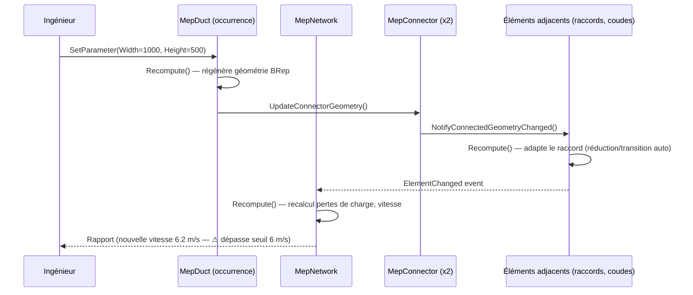

# 5. Schéma BIM (modèle propriétaire)

## 5.1 Objectifs du modèle

- Représenter à la fois la **géométrie** (BRep + maillage dérivé), la **paramétrique** (famille/type/occurrence,
  à la Revit) et la **sémantique métier MEP** (connecteurs, systèmes, réseaux) dans un modèle unique et cohérent.
- Chaque entité porte un **GUID IFC natif** dès sa création (pas de mapping a posteriori à l'export).
- Support du **LOD progressif** (100→500) sans dupliquer les objets : le LOD est un attribut d'état de l'objet,
  pas une géométrie différente stockée à côté.

## 5.2 Hiérarchie des entités

```
Project
 ├─ Level[]
 ├─ Room[]                        (associé à un Level)
 ├─ BimElement (abstrait)
 │   ├─ Architectural: Wall, Door, Window, Floor, Beam, Column
 │   └─ Mep: MepDuct, MepPipe, CableTray, MepEquipment, MepAccessory, MepFitting
 ├─ MepConnector[]                (porté par les BimElement de type Mep)
 └─ MepNetwork[]                  (regroupement logique + topologie graphe)
```

## 5.3 Modèle paramétrique (Famille / Type / Occurrence)

| Niveau | Rôle | Exemple |
|---|---|---|
| **Famille** | Catégorie fonctionnelle + jeu de paramètres déclarés | "Gaine rectangulaire" |
| **Type** | Valeurs par défaut d'un sous-ensemble de paramètres, souvent lié à un fabricant | "Gaine rect. galva 800x400 - TROX" |
| **Occurrence** | Instance placée dans le modèle, avec sa position, ses connexions, et ses éventuelles surcharges | Le tronçon entre le point A et B au niveau R+2 |

Règle de propagation : modifier un **paramètre de type** (ex. la classe d'étanchéité) impacte toutes les
occurrences de ce type qui n'ont pas de surcharge locale. Modifier un **paramètre géométrique d'occurrence**
(ex. passer 800x400 → 1000x500 sur un tronçon donné) déclenche un recalcul localisé : voir §5.4.

## 5.4 Propagation paramétrique (recalcul en cascade)



Mécanisme technique : chaque `BimElement` expose `Recompute()` ; la modification d'un paramètre marque l'élément
« dirty » et propage un événement `ElementChanged` sur le bus interne du moteur (in-process, pas de réseau) ;
un **planificateur topologique** (tri du graphe de dépendances par ordre topologique, cf. `Core.Bim/Recompute/`)
exécute les `Recompute()` dans le bon ordre, une seule fois chacun (comme le "regeneration cycle" de Revit),
en cassant les cycles potentiels par détection préalable (un cycle de dépendance géométrique est une erreur de
modélisation signalée à l'utilisateur, jamais résolu silencieusement).

## 5.5 Paramètres — typage

```csharp
public enum ParameterType { Length, Area, Volume, FlowRate, Pressure, Velocity, Text, Number, Boolean, Enum, Reference }

public sealed record ParameterDefinition(
    string Key,
    ParameterType Type,
    string Unit,              // "mm", "m3/h", "Pa", ...
    bool IsTypeParameter,     // true = porté par le Type, false = porté par l'Occurrence
    bool IsReadOnly,          // calculé (ex. vitesse) vs. saisi
    object? DefaultValue
);
```

Les paramètres calculés (vitesse, perte de charge, poids) sont `IsReadOnly = true` et recalculés à chaque
`Recompute()` — jamais stockés comme sources de vérité modifiables (cohérent avec §4.2 : `parameters JSONB`
contient un sous-ensemble "saisi" et un sous-ensemble "calculé", distingués par la définition de famille).

## 5.6 Systèmes et classification

Chaque `MepConnector` porte une `SystemClassification` (ex. `SUPPLY_AIR`, `EXTRACT_AIR`, `CHW_SUPPLY`,
`CHW_RETURN`, `DOMESTIC_COLD_WATER`, `WASTE_EU`, `WASTE_EV`, `RAINWATER_EP`, `POWER_NORMAL`, `POWER_BACKUP`,
`DATA`) — c'est cette classification qui contraint le routage (§ Core.Routing) : deux systèmes incompatibles ne
peuvent pas partager un même chemin de gaine/tuyauterie sans règle explicite (ex. mélange interdit EU/EP dans
un même collecteur sauf configuration validée).

## 5.7 Correspondance avec les LOD

| LOD | Attendu géométrique | Attendu paramétrique |
|---|---|---|
| 100 | Volume englobant / symbole schématique | Débit ou puissance visée |
| 200 | Forme approximative, dimensionnement indicatif | Type de famille générique |
| 300 | Géométrie exacte, connectée | Type précis, sans fabricant imposé |
| 350 | Idem 300 + coordination inter-lots validée | Contraintes de clearance validées |
| 400 | Géométrie fabrication (pentes, raccords réels) | Référence fabricant, données d'installation |
| 500 | Tel que construit | Données de maintenance, DOE |

Ce tableau piloté par la propriété `Project.CurrentLod` (et `BimElement.Lod` par exception locale) sert de garde-fou :
le moteur refuse un export EXE si des éléments MEP structurants restent en LOD < 300 (règle de validation, §10).
