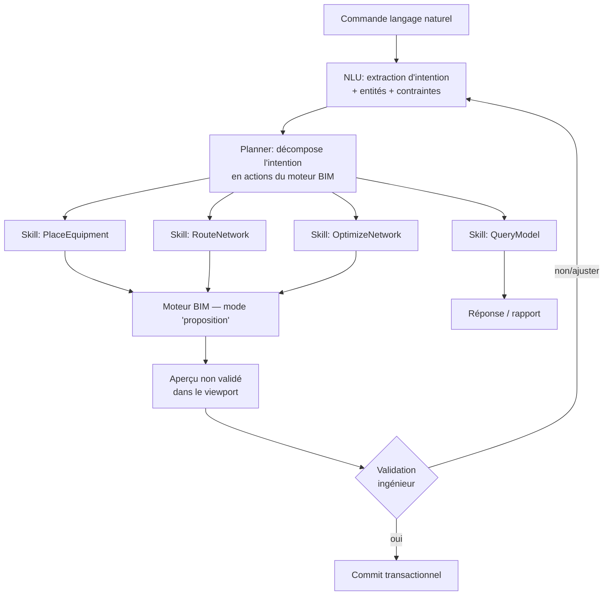

# 7. Architecture IA

## 7.1 Deux sous-systèmes IA distincts

1. **Pipeline d'import (Computer Vision + OCR + Deep Learning)** : transforme un document 2D (PDF vectoriel/scanné,
   DWG) en maquette BIM 3D partielle (LOD 100/200). Fonctionne en **batch asynchrone**, jamais en direct dans
   l'UI de modélisation.
2. **Copilote BIM (NLU + planification d'actions)** : assiste l'ingénieur pendant la modélisation par des
   commandes en langage naturel qui déclenchent des actions du moteur BIM (placement, routage, optimisation).
   Fonctionne en **synchrone conversationnel**, mais **ne modifie jamais le modèle sans validation explicite**
   (principe non négociable : cf. §1.2 point 4).

## 7.2 Pipeline d'import — détail

### 7.2.1 Étapes

| Étape | Technique | Sortie |
|---|---|---|
| Normalisation | Rasterisation à résolution cible (PDF vectoriel : rendu haute résolution ; scanné : redressement/deskew, débruitage) | Image normalisée + repère d'échelle |
| Détection d'échelle | OCR sur cartouche + reconnaissance de cotations (détection de lignes de cote + texte associé) | Facteur px→m |
| OCR généraliste | Modèle OCR (ex. architecture type PaddleOCR/TrOCR, fine-tuné plans techniques) | Textes localisés (locaux, cotes, repères) |
| Segmentation sémantique | Réseau de segmentation (U-Net / Mask R-CNN entraîné sur corpus de plans architecte) | Masques : murs, cloisons, portes, fenêtres, poteaux |
| Vectorisation | Squelettisation + fitting de segments/polylignes sur les masques | Polylignes typées |
| Reconnaissance de symboles | Détecteur d'objets (YOLO-like) entraîné sur bibliothèque de symboles CVC/plomberie/élec existants (pour rétro-conception d'un plan MEP existant) | Symboles typés + position + orientation |
| Fermeture de contours / topologie | Algorithmes géométriques (arrangement de segments, détection de cycles) | Polygones de pièces valides |
| Reconstruction 3D | Extrusion des murs sur la hauteur de niveau, insertion portes/fenêtres comme perçages | Modèle BIM LOD 100/200 |

### 7.2.2 Stack technique

- **Entraînement** : Python, PyTorch, jeux de données annotés (plans réels anonymisés + génération procédurale
  synthétique pour couvrir la diversité des chartes graphiques architecte).
- **Inférence embarquée** : export **ONNX**, exécuté via **ONNX Runtime** — permet l'inférence aussi bien côté
  service serveur (GPU, gros volumes) que côté **Desktop offline** (CPU/GPU local, mêmes poids de modèle,
  cohérence des résultats).
- **Orchestration** : job asynchrone (message broker), chaque étape est un micro-batch traçable et rejouable
  indépendamment (permet de ré-exécuter uniquement l'OCR si le facteur d'échelle était faux, sans tout refaire).

### 7.2.3 Boucle de confiance humaine

```mermaid
flowchart LR
    A[Résultat pipeline IA] --> B{Score de confiance<br/>par élément}
    B -->|élevé| C[Pré-validé, surligné en vert]
    B -->|moyen| D[À vérifier, surligné en orange]
    B -->|faible| E[Rejeté, non intégré]
    C --> F[Revue ingénieur]
    D --> F
    F --> G[Import définitif dans le modèle BIM]
    F -->|corrections| H[Réinjection comme données<br/>d'entraînement (feedback loop)]
```

Aucun élément n'entre dans le modèle de production sans passer par cette revue (même les éléments "haute confiance"
restent visuellement marqués comme "importés IA" jusqu'à validation explicite — traçabilité qualité, cf. LOD 100).

## 7.3 Copilote BIM — architecture



- **NLU** : modèle de langage (petit modèle spécialisé + grammaire de contraintes métier, pas de LLM généraliste
  sans garde-fou) qui extrait `{intention, entité_cible, grandeurs, contraintes}` — ex. `PlaceEquipment(category=CTA,
  flow=20000 m3/h)`.
- **Planner** : traduit l'intention en une séquence d'appels aux services du moteur (`Services.Catalog` pour
  trouver une référence compatible, `Core.Bim` pour créer l'occurrence, `Core.Routing` pour proposer le tracé).
- **Skills** extensibles : chaque compétence du copilote est un module indépendant et testable
  (`ai/copilot/skills/place_equipment.py`, `optimize_network.py`, ...), avec un contrat d'entrée/sortie typé
  partagé avec `Shared.Contracts`.
- **Garde-fou architectural** : le copilote n'a **aucun accès direct en écriture** à la base ; il ne peut
  qu'appeler l'API du moteur en mode `Preview`, qui retourne un delta affichable. Le `Commit` reste un acte
  utilisateur explicite (bouton "Valider"), journalisé comme toute autre modification (auteur = utilisateur,
  avec métadonnée `assisted_by = copilot`).

### 7.3.1 Exemple "Optimise le réseau pour minimiser le poids des gaines"

1. Le planner identifie le réseau ciblé (sélection active ou réseau nommé).
2. Appel à `RoutingService.OptimizeForWeight(network)` (voir §13 / `Core.Routing`), qui génère **plusieurs
   variantes** (tracés différents, sections différentes dans les plages normatives de vitesse).
3. Chaque variante est chiffrée : poids total, longueur totale, perte de charge globale, **coût matière estimé**
   (via `Services.Catalog` — prix indicatifs fabricants) et **délai d'installation estimé** (heuristique basée
   sur le nombre de raccords/coudes).
4. Présentation comparative à l'ingénieur (tableau + superposition 3D des variantes), sélection manuelle.

## 7.4 Garde-fous et gouvernance IA

- Traçabilité : tout élément créé/modifié par IA porte `assisted_by` + `model_version` dans ses métadonnées.
- Aucune décision de dimensionnement réglementaire (sécurité incendie, structure) n'est **automatiquement**
  appliquée : le copilote propose, les modules de calcul normatifs (§ Core.Calculations) valident, l'ingénieur
  signe.
- Réentraînement continu supervisé : les corrections manuelles après import (§7.2.3) alimentent un jeu de
  données de ré-entraînement versionné, jamais un ré-entraînement en ligne non contrôlé.
