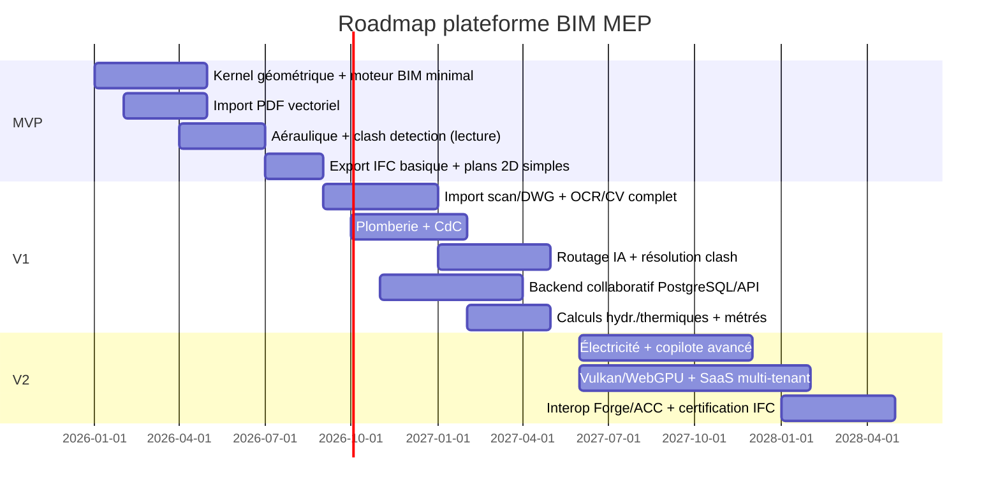

# 8/9/10. Roadmap MVP → V1 → V2

## Principe directeur

On ne repart pas de zéro : le prototype web (`apps/legacy-web/`) continue de servir les besoins immédiats
(calibration plan, calepinage, bilan, DXF) pendant que le moteur BIM natif se construit en parallèle. Le MVP
de la plateforme cible se concentre sur **un seul corps d'état (CVC aéraulique)** pour prouver la chaîne complète
import → modèle → routage → clash → calcul → export avant d'élargir.

## MVP (0 → 9 mois) — Preuve de la chaîne de valeur, périmètre restreint

**Objectif** : démontrer sur un projet réel de taille moyenne que la chaîne import PDF → maquette MEP → export
IFC fonctionne plus vite qu'un cycle Revit MEP classique, sur le réseau aéraulique uniquement.

| Domaine | Contenu |
|---|---|
| Import | PDF vectoriel uniquement (pas de scan, pas de DWG) → murs, portes, locaux, niveaux |
| Modèle BIM | `Core.Geometry` (wrapper OpenCascade minimal), `Core.Bim` (entités + paramétrique famille/type/occurrence, sans historique complet) |
| MEP | Gaines rectangulaires/circulaires, CTA, diffuseurs — pas de plomberie/électricité |
| Routage | Routage manuel assisté (snapping, alignement auto) — pas encore d'IA de routage complète |
| Calculs | Aéraulique de base (débit, vitesse, pertes de charge linéaires) |
| Clash | Détection uniquement (pas de résolution auto) |
| Rendu | Desktop Helix Toolkit (DX11), pas encore Vulkan |
| Plans | Génération de plans 2D en coupe horizontale simple |
| IFC | Export IFC4 basique (géométrie + Psets essentiels) |
| Collaboration | Mono-utilisateur, sauvegarde locale (SQLite) |
| Catalogue | 1 fabricant pilote (ex. Aldes ou TROX) en dur, pas de service dynamique |

**Critère de sortie MVP** : un ingénieur CVC modélise un plateau de bureaux (~2000 m²) du plan PDF à l'export
IFC en moins de temps qu'avec le prototype web + Revit MEP combinés sur un cas comparable.

## V1 (9 → 20 mois) — Produit utilisable en bureau d'études, 3 corps d'état

| Domaine | Ajouts vs MVP |
|---|---|
| Import | + PDF scanné (OCR/CV complet), + DWG |
| MEP | + Plomberie (EU/EV/EP, eau chaude/froide sanitaire), + Chemins de câbles/câbles (CFO/CFA de base) |
| Routage | Moteur IA complet (A*/Dijkstra, évitement d'obstacles, optimisation longueur) |
| Clash | Détection + **résolution automatique proposée** (décalages, reprises de pente) |
| Calculs | + Hydraulique complet, + Thermique (NF EN 12831 chauffage, EN 16798 confort), début RE2020 |
| Plans | Coupes, détails, isométriques automatiques, mise à jour temps réel |
| Métrés | Nomenclatures automatiques + export Excel/CSV/PDF |
| IFC | IFC2x3 + IFC4 complets, import IFC (synchronisation avec maquette archi/structure) |
| Collaboration | Multi-utilisateur (worksets, verrous), backend PostgreSQL, API Gateway |
| Rendu | Migration progressive vers Vulkan (Desktop), premier client Web (WebGL2) |
| Catalogue | Service catalogue dynamique, 4-5 fabricants (Daikin, Aldes, Systemair, Lindab) |
| Copilote IA | Premières commandes simples ("place un équipement", requêtes sur le modèle) |

**Critère de sortie V1** : un bureau d'études CVC+plomberie+CFO peut mener un projet APD→PRO complet sur la
plateforme sans repasser par Revit MEP/Stabicad pour ces 3 corps d'état.

## V2 (20 → 36 mois) — Parité concurrentielle + différenciation IA/vitesse

| Domaine | Ajouts vs V1 |
|---|---|
| Import | Reconnaissance de symboles existants (rétro-conception de plans MEP), import IFC4.3 |
| Électricité | Circuits, tableaux, notes de calcul électriques de base |
| Copilote IA | Commandes complexes (optimisation multi-critères, variantes comparées), skills étendus |
| Rendu | Vulkan complet (Desktop + Web via WebGPU), vue éclatée, section box avancée |
| Cloud | SaaS complet multi-tenant (voir §14/15), stockage collaboratif, historique de versions complet |
| Fabricants | Bibliothèque étendue (8+ fabricants), téléchargement automatique de familles |
| Conception-réalisation | Gestion explicite des jalons APS/APD/PRO/EXE avec verrouillage progressif par LOD |
| Interop | Autodesk Forge/APS (visualisation croisée, Model Derivative), export ACC-compatible |
| Qualité | Certification buildingSmart (IFC certification), audit de sécurité, SLA SaaS |

**Critère de sortie V2** : parité fonctionnelle avec Stabicad/MagiCAD sur CVC+plomberie+CFO/CFA, avec un temps de
cycle APS→EXE mesurablement inférieur (objectif : -30 % sur les projets pilotes conception-réalisation).

## Vue Gantt macro

