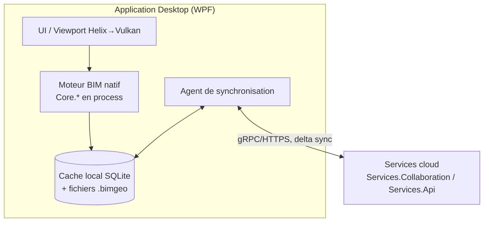
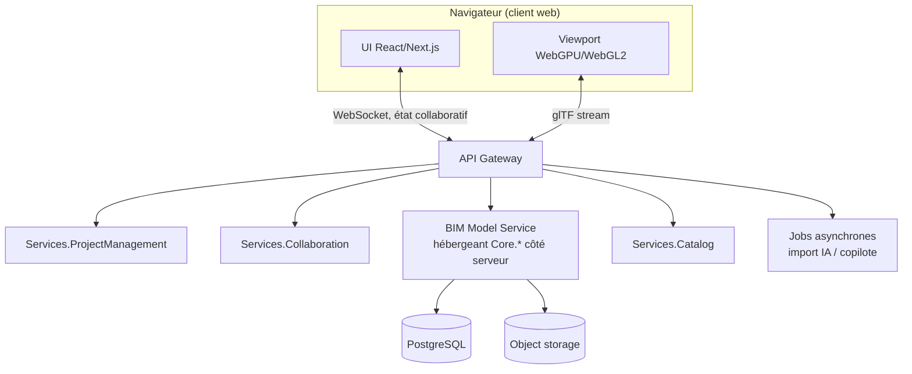

# 22. Architecture SaaS et Desktop

## 22.1 Principe : un moteur, deux hôtes

Le moteur BIM (`Core.*`, cf. §3.3) est packagé comme **bibliothèque partagée indépendante de l'hôte**. Deux
applications hôtes le consomment :

| | Desktop | SaaS (Web) |
|---|---|---|
| Public cible | Ingénieurs BE, usage intensif quotidien, gros modèles | Revue de projet, coordination multi-lots, clients occasionnels |
| Fonctionnement hors-ligne | Oui (cache SQLite + fichiers locaux, cf. §4.4) | Non (connecté par nature) |
| Performance de modélisation | Maximale (accès natif GPU, pas de latence réseau) | Bonne, contrainte par le rendu navigateur (WebGPU/WebGL2) |
| Modélisation lourde (routage complet, import IA) | Oui, localement ou déportée sur le cloud | Déportée sur le cloud systématiquement |
| Collaboration temps réel | Oui, via synchronisation avec le backend cloud | Oui, nativement |
| Déploiement | Installeur Windows (MSIX), mise à jour différentielle | Aucun déploiement client, mise à jour continue |

## 22.2 Architecture Desktop

- Le moteur tourne **dans le process Desktop** (pas d'appel réseau pour une opération de modélisation locale) :
  c'est ce qui garantit la réactivité (§15.9) et le fonctionnement offline.
- La synchronisation est **asynchrone et différentielle** (mêmes deltas que le versionnement §4.2/`element_revisions`) :
  le Desktop peut travailler des heures hors-ligne puis se resynchroniser, avec résolution de conflit basée sur
  le même mécanisme optimiste que le multi-utilisateur en ligne (§4.5).

## 22.3 Architecture SaaS

- Côté SaaS, le moteur `Core.*` tourne **côté serveur** (mêmes bibliothèques que le Desktop, exécutées dans
  `BimSvc`), le navigateur ne reçoit que des représentations dérivées (glTF pour le rendu, JSON pour les
  propriétés) — pas de portage du kernel géométrique en WASM à ce stade (complexité/risque non justifiés avant
  V2, cf. priorisation §16 P4/P5).
- Un même projet peut être ouvert simultanément en Desktop et en Web par des utilisateurs différents : c'est le
  backend cloud qui est l'arbitre unique de la cohérence (le Desktop n'est jamais source de vérité seul dès
  qu'il y a plus d'un utilisateur sur le projet).

## 22.4 Édition multi-tenant (SaaS)

- Isolation par `organization_id` avec Row-Level Security PostgreSQL (§15.8).
- Plans de service différenciés par : nombre de projets actifs, taille de modèle (nb d'éléments), quota de
  jobs IA (import/copilote) mensuels, SLA de disponibilité.
- Le Desktop reste vendu en licence indépendante ou inclus dans un plan SaaS supérieur (bundle) — choix
  commercial à trancher en V1, l'architecture ne préempte pas ce choix (le couplage Desktop↔Cloud est optionnel
  techniquement, cf. mode offline).
