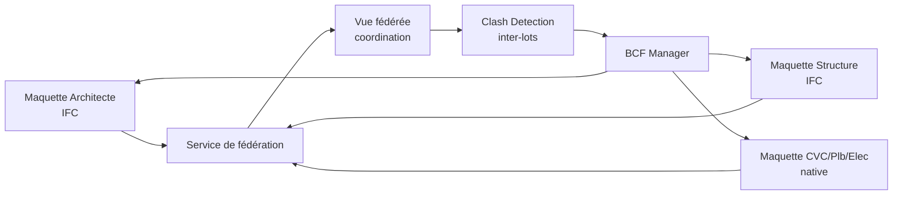

# 23. Plan de migration vers une plateforme cloud collaborative type Autodesk Construction Cloud

## 23.1 Objectif

Faire évoluer la plateforme (Desktop + SaaS mono-projet, §22) vers une **plateforme collaborative multi-lots,
multi-intervenants**, comparable dans son usage à Autodesk Construction Cloud (ACC) : hub de projets partagé
entre maîtrise d'œuvre, bureaux d'études tous corps d'état, entreprises, avec gestion documentaire, coordination
IFC/BCF, et suivi de chantier (EXE→DOE).

## 23.2 Étapes de migration

### Étape 1 — Fondations cloud collaboratives (fin V1 / début V2)

- Généralisation du modèle multi-tenant (§22.4) à un **hub d'organisation** regroupant plusieurs projets et
  plusieurs entreprises invitées par projet (rôles externes : "intervenant invité" en lecture/commentaire).
- Mise en place du **BCF Manager** (§6.5) comme service central de coordination inter-lots, indépendant du
  moteur BIM (peut recevoir des conflits même depuis des outils tiers Solibri/BIMcollab/Navisworks).
- Gestion documentaire de base (versions de fichiers IFC/PDF échangés, horodatage, statut de diffusion — visa,
  bon pour exécution).

### Étape 2 — Fédération de maquettes multi-lots (V2)

- Le service de fédération assemble les maquettes de chaque corps d'état (natif pour le nôtre, IFC pour les
  tiers) en une **vue de coordination** sans fusionner les modèles sources (chaque BE reste propriétaire de
  son modèle, cohérent avec la pratique du marché).
- Clash detection inter-lots exécuté sur la fédération, résultats publiés en BCF vers chaque outil source.

### Étape 3 — Interopérabilité Autodesk (Forge/APS) (V2)

- Intégration **Autodesk Platform Services (APS)** : Model Derivative API pour permettre la visualisation de
  nos modèles dans des viewers tiers Autodesk, Data Management API pour l'échange de fichiers avec des projets
  hébergés sur ACC — objectif : **interopérer avec ACC**, pas nécessairement le remplacer chez les clients déjà
  équipés Autodesk (adoption facilitée en environnement mixte).
- Cette intégration reste un connecteur optionnel, jamais une dépendance structurante du moteur (cohérent avec
  le principe §1.2.1 "pas de dépendance à un host").

### Étape 4 — Suivi de chantier et DOE (V2 tardif / au-delà)

- Extension du hub vers le suivi d'exécution : rattachement de documents de chantier (fiches de contrôle,
  photos géolocalisées) aux éléments BIM concernés (LOD 400/500, cf. §5.7), consolidation automatique du DOE
  numérique (maquette tel-que-construit + documents liés).

## 23.3 Impacts architecturaux à anticiper dès maintenant

Pour que cette migration ne nécessite pas de refonte :

1. **`Services.Collaboration` doit être conçu multi-organisation dès V1**, même si l'usage V1 reste
   mono-organisation par projet (ne pas coder en dur l'hypothèse "un projet = une seule entreprise").
2. **Le modèle IFC/BCF (§6) est traité comme un citoyen de première classe**, pas comme un simple export — la
   fédération multi-lots en dépend entièrement.
3. **Les GUID IFC sont stables et jamais régénérés** (§5.1, §6.4) : condition nécessaire pour qu'une
   coordination multi-lots sur plusieurs mois reste cohérente malgré les aller-retours de fichiers.
4. **Le stockage objet (S3-compatible) est déjà multi-tenant et versionné dès le MVP** (§4.4) : la gestion
   documentaire de l'étape 1 en est une extension, pas une nouvelle brique.

## 23.4 Ce que cette plateforme ne cherche pas à être

Pour rester réaliste sur le périmètre : l'objectif n'est pas de recréer l'intégralité de la suite ACC
(gestion financière de chantier, RFI, submittals, planning Gantt de chantier) mais la **partie BIM MEP et
coordination technique**, avec des points d'interopérabilité ouverts (IFC/BCF/Forge) vers les outils de gestion
de chantier existants du marché plutôt que de les réimplémenter.
